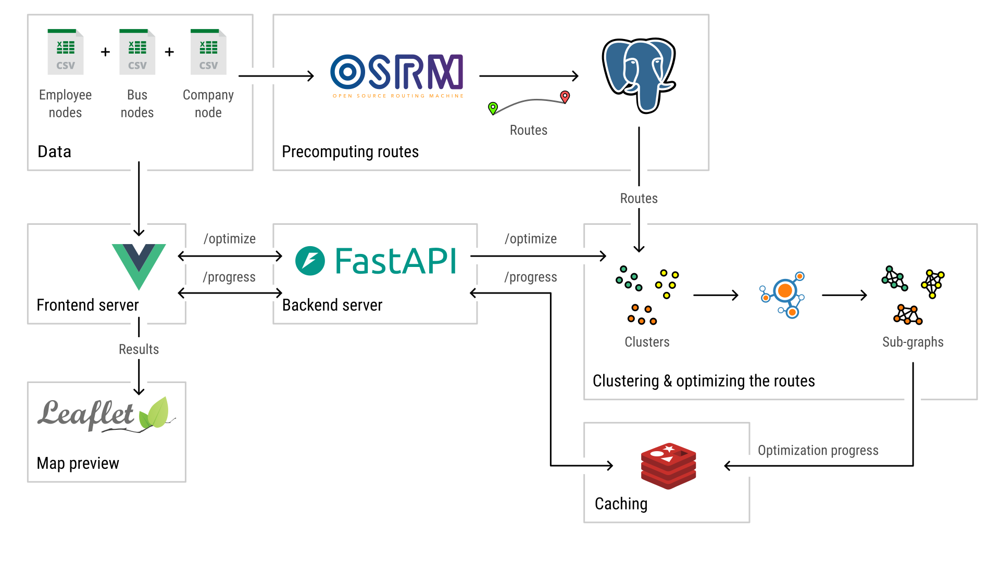

# Multi-depot single-sink vehicle routing problem

This repository showcases an exploration of the multi-depot single-sink vehicle routing problem. While the solution provided here isn't necessarily optimal, it offers valuable insights and techniques worth sharing. The repository serves as the source code for a course I will be publishing on my [YouTube channel](https://www.youtube.com/@3CodeCampers).

## Project overview

Below is the pipeline illustrating the project's workflow:  


## Features

This project is a full-stack web application built using **Vue.js** for the frontend and **FastAPI**, **Redis**, and **PostgreSQL** for the backend. By following the course, you'll not only learn these technologies but also gain deeper insights into related topics.

### Route generation between points

Learn how to generate routes given a set of points on a map using the [OSRM backend](https://github.com/Project-OSRM/osrm-backend), a robust routing engine.

- OSRM ensures all routes are valid, handling complex computations for you.  
- Generated routes are stored in a **PostgreSQL** database, which can consume 1–2 GB of storage depending on the number of nodes.  

💡 **Tip**: Avoid loading the entire dataset into memory to prevent saturation. Instead, store and query data as needed.

### Graph construction

Convert points and routes into a fully connected graph using the [NetworkX](https://github.com/networkx/networkx) library, enabling advanced graph-based computations.

### Data clustering

For multi-depot problems, data clustering is essential. Each cluster will correspond to a bus and a set of assigned employees, serving as a preparatory step before optimization.

### Optimization

This problem is a variation of the [Traveling Salesman Problem (TSP)](https://en.wikipedia.org/wiki/Travelling_salesman_problem) and the [Hamiltonian Path Problem (HPP)](https://en.wikipedia.org/wiki/Hamiltonian_path_problem). Instead of returning to the starting node, routes terminate at the company node.

- Approximate solutions to the TSP are provided by the **NetworkX** library.

### Visualizing data on a map

Visualize optimized routes on an interactive map using [Leaflet](https://github.com/Leaflet/Leaflet).

- **Light mode**: Powered by free [OpenStreetMaps](https://github.com/openstreetmap/openstreetmap-website) tiles.  
- **Dark mode**: Styled with [Stadia Maps](https://docs.stadiamaps.com/map-styles/alidade-smooth-dark/).  

**Light mode map preview**  


**Dark mode map preview**  


---

## Requirements

### Prerequisites

#### Docker

Install Docker to set up both **Redis** and the **OSRM backend**. Refer to the [official docs](https://docs.docker.com/engine/install/) for instructions.

#### Redis setup  

Use Docker to set up a Redis container:  

```bash
sudo docker pull redis
sudo docker run --name redis-container -d -p 6379:6379 redis
```

Verify Redis is running:  

```bash
redis-cli -h 127.0.0.1 -p 6379
```

Type `PING` to confirm the connection:  

```bash
127.0.0.1:6379> PING
PONG

127.0.0.1:6379> exit
```

#### PostgreSQL  

Install PostgreSQL either locally or using Docker. For Linux installations:  

```bash
sudo apt install postgresql
```

Optional: Install **pgAdmin** for database management:  

```bash
curl -fsS https://www.pgadmin.org/static/packages_pgadmin_org.pub | sudo gpg --dearmor -o /usr/share/keyrings/packages-pgadmin-org.gpg

sudo sh -c 'echo "deb [signed-by=/usr/share/keyrings/packages-pgadmin-org.gpg] https://ftp.postgresql.org/pub/pgadmin/pgadmin4/apt/$(lsb_release -cs) pgadmin4 main" > /etc/apt/sources.list.d/pgadmin4.list && apt update'

sudo apt install pgadmin4 pgadmin4-desktop
```

#### OSRM Backend

Refer to the [OSRM backend documentation](https://github.com/Project-OSRM/osrm-backend?tab=readme-ov-file#using-docker) for installation using Docker.

---

### Frontend setup  

1. Install [Vue.js](https://vuejs.org/guide/quick-start.html).  
2. Navigate to the `frontend` directory and install the dependencies:

   ```bash
   cd frontend/
   npm install
   ```

### Backend setup  

1. Install **FastAPI**:  

   ```bash
   pip install "fastapi[standard]"
   ```

2. Install backend dependencies:  

   ```bash
   cd backend/
   pip install -r requirements.txt
   ```

---

## Running the application

1. Start the Redis container:  

   ```bash
   sudo docker start redis-container
   ```

2. Launch the frontend:  

   ```bash
   cd frontend/
   npm run serve
   ```

3. Start the backend:  

   ```bash
   cd backend/
   fastapi dev main.py
   ```

💡 **Note**: Ensure the PostgreSQL server is running, and the database is populated with route data using the provided notebooks and dummy data.

---

## Contributing

Contributions are welcome! Feel free to fork the repository, make changes, and open a pull request.

---

## Contact

- **Email**: [simad3647@gmail.com](mailto:simad3647@gmail.com)
- **LinkedIn**: [Imad Saddik](https://www.linkedin.com/in/imadsaddik/)

---

## Acknowledgments

Special thanks to these amazing tools and projects:

- [OSRM backend](https://github.com/Project-OSRM/osrm-backend)
- [NetworkX](https://github.com/networkx/networkx)  
- [OpenStreetMaps](https://www.openstreetmap.org/)  
- [Leaflet](https://github.com/Leaflet/Leaflet)  
- [Stadia Maps](https://stadiamaps.com/)  
- [PrimeVue](https://github.com/primefaces/primevue)  

And of course, to all the creators of the open-source technologies used in this project! 😊  
